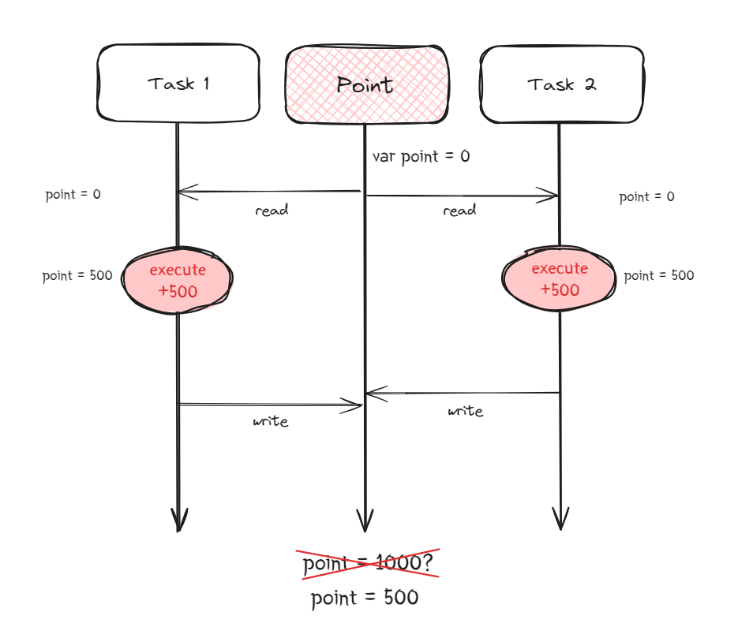
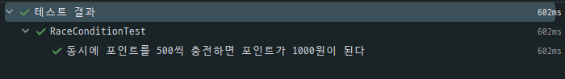
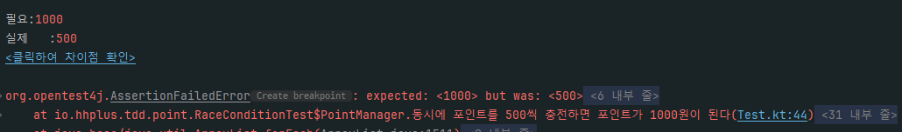
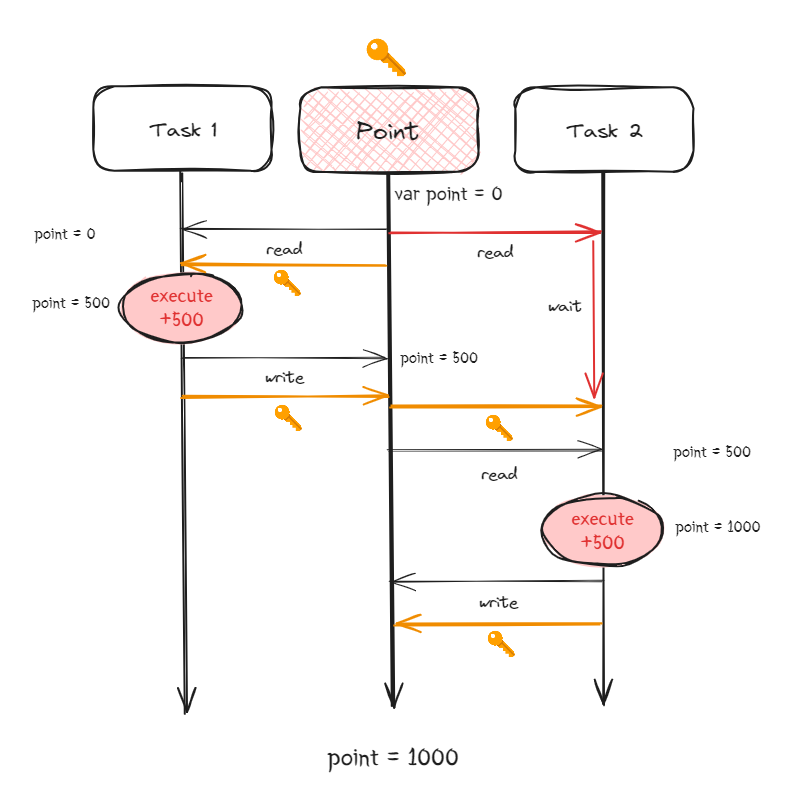
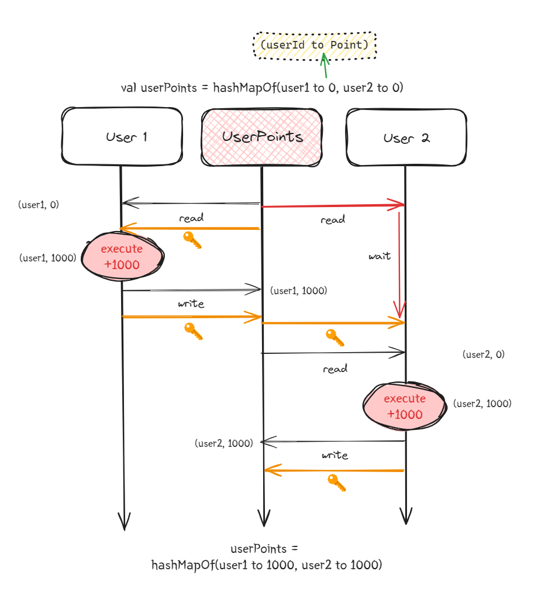
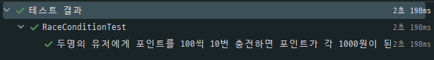
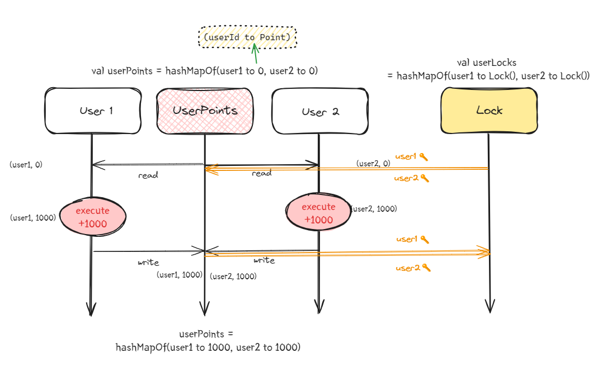
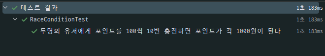

<br/><br/>

## 1. 동시성 처리는 왜 하는 걸까?

동시성 처리를 하지 않으면 유저가 포인트를 동시에 충전 또는 사용할 때 데이터 불일치 문제가 발생합니다. 이는 여러 스레드가 같은 리소스에 접근하면서 발생하는 `Race Condition`(경쟁 상태) 현상이라 볼 수 있는데, `Race Condition`이란 공유 자원에 대해 여러 프로세스가 동시에 접근을 시도할 때, 실행 순서나 시간에 의해 결과 값에 영향을 줄 수 있는 상태를 말합니다.

<br/>

아래 그림을 통해 `Race Condition`에 대한 예시를 들어보겠습니다.


<br/>

위 그림과 같이 2개의 스레드에서 실행된 각각의 태스크가 `point`라는 변수에 동시에 접근하여 초기값 0을 읽어왔습니다. 그리고 각각 500을 더하는 연산을 수행하고, `point`에 결과 값을 대입했습니다. 그러나 기대와는 다르게 1000이 아닌 500이 나오게 됩니다.  

<br/>

해당 문제 상황을 테스트 코드로 살펴보겠습니다.

```kotlin
class RaceConditionTest {

    inner class PointManager {
        private var point = 0

        fun add(amount: Int) {
            Thread.sleep(100)
            point += amount
        }

        fun getPoint(): Int {
            return point
        }
    }

    @Test
    fun `동시에 포인트를 500씩 충전하면 포인트가 1000원이 된다`() {
        // given
        val pointManager = PointManager()
        val executor = Executors.newFixedThreadPool(2)

        val tasks = listOf(
            Callable { pointManager.add(500) },
            Callable { pointManager.add(500) },
        )

        // when
        executor.invokeAll(tasks)
        executor.shutdown()

        // then
        assertEquals(1000, pointManager.getPoint())
    }
}
```

<br/>

위 코드는 스레드 풀에 2개의 스레드를 생성하고, 포인트를 500 증가 시키는 태스크 2개를 수행한 예제입니다. 위 테스트를 수행해보면 성공하는 경우도 있지만 실패하는 경우도 생기게 됩니다. 그 이유는 스레드가 수행하는 순서나 타이밍이 매번 달라져 결과값이 달라지기 때문입니다.

<br/>

<p align="center">
  
  성공하거나
</p>

<p align="center">
  
  실패한다
</p>   

<br/>
      
그럼 우리는 어떻게 해야 테스트를 항상 성공적으로 수행 가능하게 만들 수 있을까요?   

<br/><br/>

## 2. synchronized를 이용한 접근 제한

<br/>

이번에도 다른 예제의 그림을 보면서 다시 생각해 보겠습니다.



<br/>

이번에는 `point`에 잠금 장치를 부여했습니다. 열쇠를 가지고 있는 스레드만 접근을 허용하고, 열쇠를 가지고 있지 않은 스레드는 `point` 로부터 열쇠를 얻기 전까지는 대기 상태에 빠지게 됩니다. 이후 열쇠를 받게 되면 로직을 수행하게 됩니다.

이렇게 되면 이전에 발생한 동시성 문제를 쉽게 해결할 수 있습니다. `point`와 같은 공유 자원에게 스레드가 순차적으로 접근하도록 보장하면서 원하는 결과값을 도출할 수 있게 되었습니다. 이와 같이 동시접근 하려고 하는 자원에서 문제가 발생하지 않게 독점을 보장해줘야 하는 영역을 `임계 영역`이라고 합니다.

Java 진영에선 `임계 영역`을 쉽게 설정해줄 수 있습니다. `synchronized` 라는 키워드를 사용할 수 있는데, 이 키워드를 사용하여 임계영역을 설정하면, 동시에 여러 스레드가 같은 리소스에 접근하는 문제를 해결할 수 있습니다. 간단하게 임계 영역을 지정할 메서드 위에 `@Synchronized` 어노테이션만 선언해주면 됩니다.

<br/>

```kotlin
class RaceConditionTest {

    inner class PointManager {
        private var point = 0

	@Synchronized
        fun add(amount: Int) {
            Thread.sleep(10)
            point += amount
        }

        fun getPoint(): Int {
            return point
        }
    }

    @Test
    fun `동시에 포인트를 500씩 충전하면 포인트가 1000원이 된다`() {
        // given
        val pointManager = PointManager()
        val executor = Executors.newFixedThreadPool(2)

        val tasks = listOf(
            Callable { pointManager.add(500) },
            Callable { pointManager.add(500) },
        )

        // when
        executor.invokeAll(tasks)
        executor.shutdown()

        // then
        assertEquals(1000, pointManager.getPoint())
    }
}
```

<br/>

첫 번째로 봤던 예시 코드와 비교해보면 `add()` 메서드 에 `@Synchronized` 만 추가한 것 빼곤 완전 동일한 코드입니다.  임계 영역을 설정함으로써 공유 자원에 대해 여러 스레드가 접근해도 동일한 결과값을 받을 수 있게 되었습니다.

그럼 이제 각 유저 별로 포인트를 관리하도록 예제를 변경해보겠습니다.



<br/>

유저 ID를 키로 가지는 `HashMap` 을 사용해  유저 별로 포인트를 관리하도록 변경했습니다. 아래는 변경한 코드입니다.

```kotlin
class RaceConditionTest {

    inner class PointManager {
        private val userPoints: MutableMap<Int, Int> = HashMap()

        @Synchronized
        fun add(userId: Int, amount: Int) {
            Thread.sleep(100)
            val point = userPoints.getOrDefault(userId, 0)
            userPoints[userId] = point + amount
        }

        fun getPoint(userId: Int): Int {
            return userPoints.getOrDefault(userId, 0)
        }
    }

    @Test
    fun `두명의 유저에게 포인트를 100씩 10번 충전하면 포인트가 각 1000원이 된다`() {
        // given
        val pointManager = PointManager()
        val executor = Executors.newFixedThreadPool(10)

        val tasks = mutableListOf<Callable<Unit>>()

        repeat(10) {
            tasks.add(Callable { pointManager.add(1, 100) }) // 유저1
            tasks.add(Callable { pointManager.add(2, 100) }) // 유저2
        }

        // when
        executor.invokeAll(tasks)
        executor.shutdown()

        // then
        assertEquals(1000, pointManager.getPoint(1))
        assertEquals(1000, pointManager.getPoint(2))
    }
}
```

<br/>



<br/>

`Synchronized` 덕분에 위와 같이 동시에 충전해도 각 유저 별로 1000원이 충전이 잘 되는 것을 확인할 수 있습니다.

그런데 이상한 점이 있습니다. 예리한 관찰력이라면 이미 발견했을 수도 있는데, 바로 테스트 결과의 수행 시간입니다. `add()` 를 수행하는데 약 0.1초가 걸린다면 각 유저 별로 1초가 걸리니 테스트도 약 1초가 수행되어야 합니다. 하지만 *유저1과 유저2는 서로 가져간 락을 받기 위해 대기 상태에 빠지고 결국 수행 시간이 2초가 넘어가는 것을 확인할 수 있습니다.* 여기서 `Synchronized` 의 단점을 발견할 수 있습니다.

### `synchronized` 의 단점

`Synchronized` 는 전역적으로 락을 걸기 때문에 두 명 이상의 유저가 해당 블록에 접근할 경우, 서로의 락에 걸려버리는 상황이 생깁니다. 우리가 원하는 것은 다른 유저의 충전 요청에 상관없이 약 1초 만에 포인트를 충전하는 것입니다.

<br/><br/>

## 3. 유저별 Lock 객체 구현

<br/>

`Synchronized` 는 Java 1.0부터 제공되는 기능이며, Java 1.5부터 java,util.concurrent라는 동시성 문제 해결을 위한 패키지가 추가되었습니다. 해당 패키지에는 `Lock` 인터페이스와 `ReentrantLock` 구현체가 제공됩니다.

`ReentrantLock` 도 `Synchronized` 와 마찬가지로 임계 영역을 설정하지만, 보다 정교하게 사용이 가능합니다. 우리에게 필요한 것은 유저 별로 락을 관리하는 것입니다. 다음 예시를 아래 그림을 통해 알아보겠습니다.

<br/>



<br/>

Lock을 담당하는 `userLocks`를 만들어 이제 유저마다 락을 관리하도록 변경했습니다. 변경된 코드를 작성해보겠습니다.

```kotlin
class RaceConditionTest {

    inner class LockManager {
        private val userLocks: MutableMap<Int, Lock> = HashMap()

        fun getLock(userId: Int): Lock {
            return userLocks.computeIfAbsent(userId) { ReentrantLock() }
        }
    }

    inner class PointManager(private val lockManager: LockManager) {
        private val userPoints: MutableMap<Int, Int> = HashMap()

        fun add(userId: Int, amount: Int) {
            val lock = lockManager.getLock(userId)
            lock.lock()
            try {
                Thread.sleep(100)
                val point = userPoints.getOrDefault(userId, 0)
                userPoints[userId] = point + amount
            } finally {
                lock.unlock()
            }
        }

        fun getPoint(userId: Int): Int {
            return userPoints.getOrDefault(userId, 0)
        }
    }

    @Test
    fun `두명의 유저에게 포인트를 100씩 10번 충전하면 포인트가 각 1000원이 된다`() {
        // given
        val lockManager = LockManager()
        val pointManager = PointManager(lockManager)
        val executor = Executors.newFixedThreadPool(2)

        val tasks = mutableListOf<Callable<Unit>>()

        repeat(10) {
            tasks.add(Callable { pointManager.add(1, 100) }) // 유저1
            tasks.add(Callable { pointManager.add(2, 100) }) // 유저2
        }

        // when
        executor.invokeAll(tasks)
        executor.shutdown()

        // then
        assertEquals(1000, pointManager.getPoint(1))
        assertEquals(1000, pointManager.getPoint(2))
    }
}
```

<br/>

`LockManager`  클래스를 만들어 유저 별 `ReentrantLock` 을 관리하도록 했습니다. 그리고 실행 결과는 아래와 같습니다.



<br/>

이로써 저희가 원했던 대로 다른 유저의 포인트 충전 요청과는 상관없이 충전 소요 시간이 약 1초 걸리는 것을 볼 수 있게 되었습니다!
